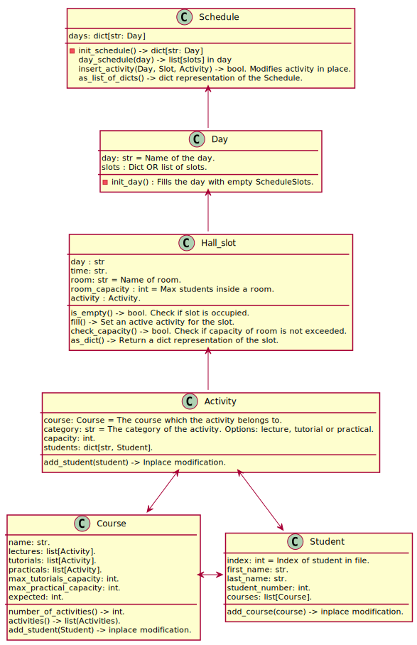
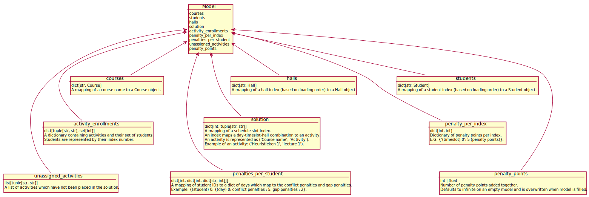

# UML Diagram

@startuml
'Change only this value depending of the number of @startuml/@enduml on the full file
'https://forum.plantuml.net/13673/make-multiple-%40startuml%40enduml-blocks-file-generate-diagram
!$max=2
!$i=1
label l [
!while $i < $max+1
  {{
  !include %filename()!$i
  }}
  !$i = $i +1
!endwhile
]
@enduml

@startuml FirstDiagram

class Schedule{
    days: dict[str: Day]
    -init_schedule() -> dict[str: Day]
    day_schedule(day) -> list[slots] in day
    insert_activity(Day, Slot, Activity) -> bool. Modifies activity in place.
    as_list_of_dicts() -> dict representation of the Schedule.
}

class Day{
    day: str = Name of the day.
    slots : Dict OR list of slots.
    -init_day() : Fills the day with empty ScheduleSlots.
}

class Hall_slot{
    day : str
    time: str.
    room: str = Name of room.
    room_capacity : int = Max students inside a room.
    activity : Activity.
    is_empty() -> bool. Check if slot is occupied.
    fill() -> Set an active activity for the slot.
    check_capacity() -> bool. Check if capacity of room is not exceeded.
    as_dict() -> Return a dict representation of the slot.
}

class Activity{
    add_student(student) -> Inplace modification.
    course: Course = The course which the activity belongs to.
    category: str = The category of the activity. Options: lecture, tutorial or practical.
    capacity: int.
    students: dict[str, Student].
}

class Course{
    number_of_activities() -> int.
    activities() -> list(Activities).
    add_student(Student) -> inplace modification.
    name: str.
    lectures: list[Activity].
    tutorials: list[Activity].
    practicals: list[Activity].
    max_tutorials_capacity: int.
    max_practical_capacity: int.
    expected: int.
}

class Student{
    add_course(course) -> inplace modification.
    index: int = Index of student in file.
    first_name: str.
    last_name: str.
    student_number: int.
    courses: list[Course].
}

Day -up-> Schedule
Hall_slot -up-> Day
Activity -up-> Hall_slot
Activity <-down-> Course
Activity <-down-> Student
Course <-right-> Student

@enduml

@startuml ModelDiagram

object Schedule{
    {field} index : int = Maps a unique index to a day-timeslot-hall combination ranging from 0 to 144 
        ((4 timeslots * 7 rooms + 1 evening slot) * 5 days).
    activity : str = string representation of the Activity object.
}

object Activity_participant_list{
    activity : str = string representation of the Activity object.
    student : str = string representation of the Student object. Based on their index number.
}

Schedule <- Activity_participant_list

@enduml

