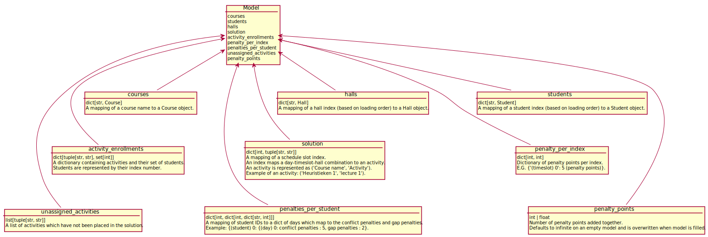

# UML Diagram

@startuml
'Change only this value depending of the number of @startuml/@enduml on the full file
'https://forum.plantuml.net/13673/make-multiple-%40startuml%40enduml-blocks-file-generate-diagram
!$max=2
!$i=1
label l [
!while $i < $max+1
  {{
  !include %filename()!$i
  }}
  !$i = $i +1
!endwhile
]
@enduml

@startuml ImmutableData

class Activity{
    add_student(student) -> Inplace modification.
    course: Course = The course which the activity belongs to.
    category: str = The category of the activity. Options: lecture, tutorial or practical.
    capacity: int.
    students: dict[str, Student].
}

class Course{
    number_of_activities() -> int.
    activities() -> list(Activities).
    add_student(Student) -> inplace modification.
    name: str.
    lectures: list[Activity].
    tutorials: list[Activity].
    practicals: list[Activity].
    max_tutorials_capacity: int.
    max_practical_capacity: int.
    expected: int.
}

class Student{
    add_course(course) -> inplace modification.
    index: int = Index of student in file.
    first_name: str.
    last_name: str.
    student_number: int.
    courses: list[Course].
}

Activity <-down-> Course
Activity <-down-> Student
Course <-right-> Student

@enduml

@startuml ModelDiagram

object Model{
    courses
    students
    halls
    solution
    activity_enrollments
    penalty_per_index
    penalties_per_student
    unassigned_activities
    penalty_points
}

object courses{
    dict[str, Course]
    A mapping of a course name to a Course object.
}

object students{
    dict[str, Student]
    A mapping of a student index (based on loading order) to a Student object.
}

object halls{
    dict[str, Hall]
    A mapping of a hall index (based on loading order) to a Hall object.
}

object solution{
    dict[int, tuple[str, str]]
    A mapping of a schedule slot index.
    An index maps a day-timeslot-hall combination to an activity.
    {field} An activity is represented as ('Course name', 'Activity').
    {field} Example of an activity: ('Heuristieken 1', 'lecture 1').
}

object activity_enrollments{
    dict[tuple[str, str], set[int]]
    A dictionary containing activities and their set of students.
    Students are represented by their index number.
}

object penalty_per_index{
    dict[int, int]
    Dictionary of penalty points per index.
    E.G. {'(timeslot) 0': 5 (penalty points)}.
}

object penalties_per_student{
    dict[int, dict[int, dict[str, int]]]
    A mapping of student IDs to a dict of days which map to the conflict penalties and gap penalties.
    Example: {(student) 0: {(day) 0: conflict penalties : 5, gap penalties : 2}.
}

object unassigned_activities{
    list[tuple[str, str]]
    A list of activities which have not been placed in the solution.
}

object penalty_points{
    int | float
    Number of penalty points added together.
     Defaults to infinite on an empty model and is overwritten when model is filled.
}

Model <-up- courses
Model <-up- students
Model <-up- halls
halls <-[hidden]- solution
Model <-up- solution
courses <-[hidden]- activity_enrollments
Model <-up- activity_enrollments
students <-[hidden]- penalty_per_index
Model <-up- penalty_per_index
solution <-[hidden]- penalties_per_student
Model <-up- penalties_per_student
activity_enrollments <-[hidden]- unassigned_activities
Model <-up- unassigned_activities
penalty_per_index <-[hidden]- penalty_points
Model <-up- penalty_points

@enduml

